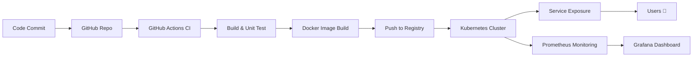

<h1 align="center">Hi 👋, I'm Prashu Mishra</h1>

<p align="center">
  
</p>

---

## 🚀 About Me

- 🔭 Building **Production-Grade Scalable Systems**
- 🌱 Learning **Kubernetes, Terraform, Advanced CI/CD**
- ⚡ Focused on **Automation, Reliability & Observability**
- 🧠 Strong interest in **System Design & DevOps Architecture**
- 🎯 Goal: Become a **Top DevOps Engineer**

---

## 🧠 Tech Stack

<p align="center">

</p>

---

## ⚡ End-to-End DevOps Pipeline



---

## 🚀 Featured Projects

### 🔥 Job Platform Hub
- 🏗️ Enterprise-grade job board system  
- 🔐 Authentication + API + UI  
- ☁️ Ready for cloud deployment  

### 🤖 AI Agent
- 🧠 AI-powered  assistant  
- ⚙️ CI/CD automation + Kubernetes  
- 📊 Observability + logging system  

---

## 📦 CI/CD + Deployment Status

<p align="center">
  
  
  
</p>

---

## ☸️ Kubernetes & Cloud

<p align="center">
  
  
  
</p>

---

## 📊 Observability Stack

<p align="center">
  
  
  
</p>

---

## 📊 GitHub Analytics

<p align="center">
  
</p>

<p align="center">
  
</p>

<p align="center">
  
</p>

---

## 🚀 Live Production Status

<p align="center">
  
  
  
</p>

---

## 🧩 Contribution Snake

<p align="center">
  
</p>

---

## 🔗 Connect With Me

<p align="center">
  <a href="https://github.com/prashumishra1204">
    
  </a>
</p>

---

## 💡 Engineering Philosophy

> "If it’s manual, automate it. If it breaks, monitor it. If it scales, design it."

---

## ⚙️ Setup Instructions (One-Time)

### 1. Replace Values
- `REPO_NAME` → your repository name  
- `https://your-domain.com` → your deployed app  

### 2. Enable Snake Animation

Create file: `.github/workflows/snake.yml`

```yaml
name: Generate Snake

on:
  schedule:
    - cron: "0 0 * * *"
  workflow_dispatch:

jobs:
  generate:
    runs-on: ubuntu-latest
    steps:
      - uses: Platane/snk@v3
        with:
          github_user_name: prashumishra1204
          outputs: |
            dist/github-contribution-grid-snake.svg
      - uses: crazy-max/ghaction-github-pages@v3
        with:
          target_branch: output
          build_dir: dist
```

---

⭐️ From [prashumishra1204](https://github.com/prashumishra1204)
